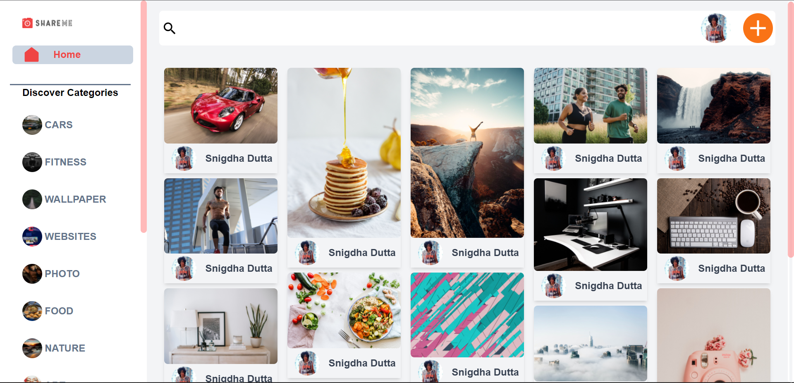
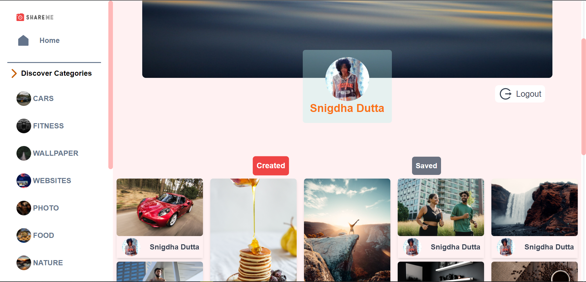
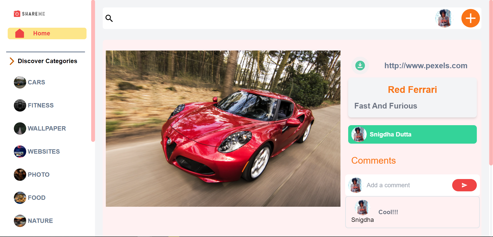
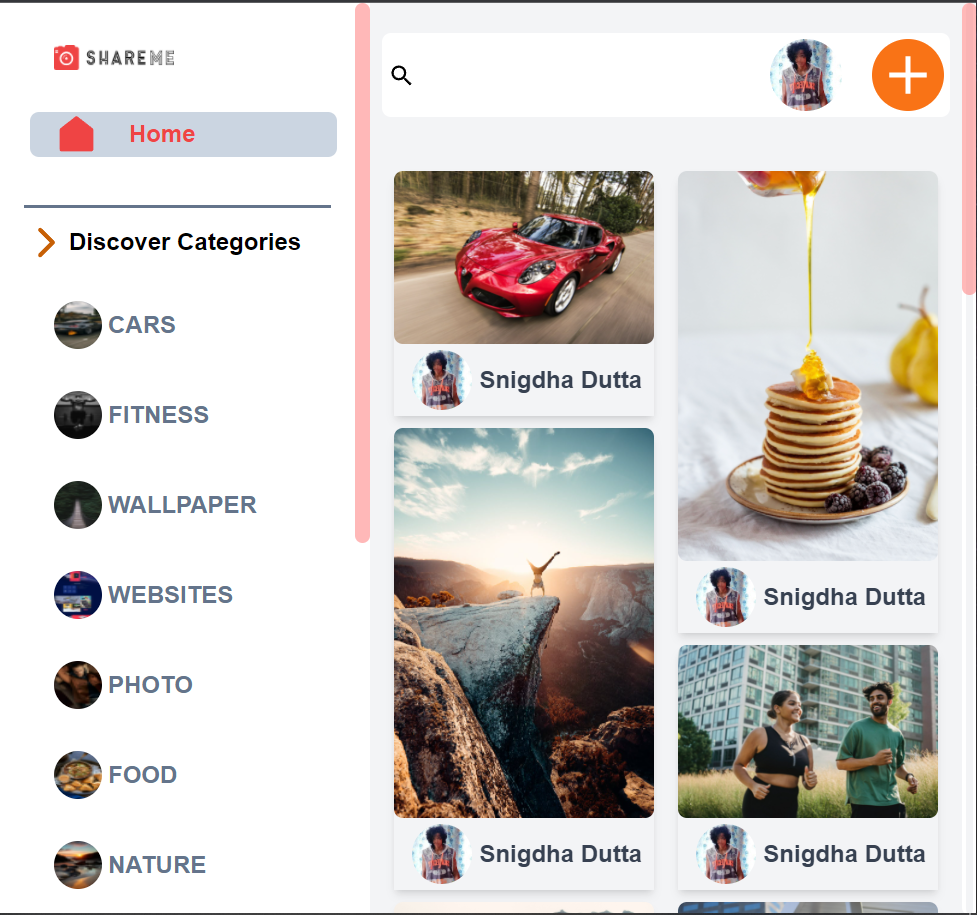
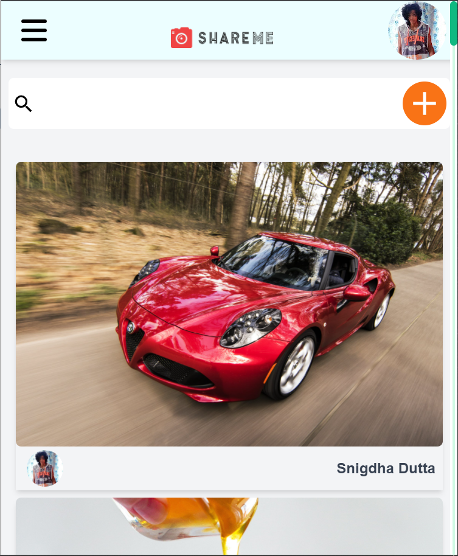

# Social Media App

**This is a REACT Application built with SANITY as backend and integrated with Google Authenticaation (session or cookie token maybe implemented)**

- The App design is Custom and is Mobile Responsive as well
- Use Of Nesting React Router Feature for Custom Component Rendering on Different Pages
- Frontend Built with `REACT` and UI Designed with `Tailwind CSS`
- Backend Integrated With `SANITY CMS`
- Search Functionality, Save And Create Post as well as Delete Own Post
- Comment on Other Posts
- Download Image Functionality
- User Details and Pin Details Page
- Live on Netlify - [Visit](https://social-media-share.netlify.app)
  
  
  

# Mobile Responsive Design

